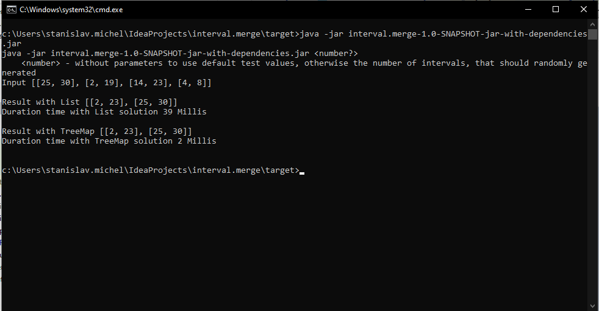
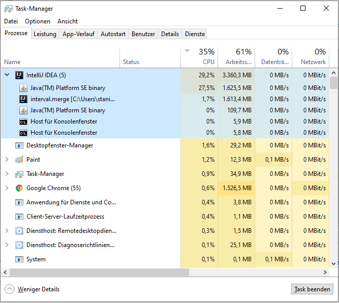

# Merge overlapping intervals
**Description**: Merge overlapping intervals with 2 solutions: Java List through Collections.sort otherwise TreeMap

**Dependencies**: Apache Maven

**Installation**: implemented in Java 11  
1. Download Apache Maven http://ftp.halifax.rwth-aachen.de/apache/maven/maven-3/3.6.3/binaries/apache-maven-3.6.3-bin.zip  
2. Extract apache-maven-3.6.3-bin.zip and set environment variables ```M2_HOME``` and ```MAVEN_HOME``` with maven path in system - [set environment variables](https://ronasoft.de/einrichtung-von-apache-maven-unter-microsoft-windows-10/)  
3. Clone repository https://github.com/stanislavmi/interval.merge and run in project folder 
```mvn clean package -f pom.xml```.

**Usage**: Jar execute in target folder  
* ```java -jar interval.merge-1.0-SNAPSHOT-jar-with-dependencies.jar <number parameter>```
  - ```number parameter - number of random generated intervals or empty number```
  


1. Laufzeit:  
Lösung 1 benutzt List mit Methode Collection.sort (merge sort) und hat die Komplexität für Collections.sort ```O(n*log(n)) + FOR Schleife O(n), also O(n*log(n))+O(n)```  
Lösung 2 funktioniert mit TreeMap (red-black tree) hat die Komplexität beim Einfügen in TreeMap ```O(log(n)) + O(n)``` in FOR Schleife

2. Robustheit:  
Die Robustheit hängt von Größe der Eingabe und von ausgewählter Datenstruktur ab. 
TreeMap basiert auf red-black tree. Es werden Duplikate nicht gespeichert und die Schlüssel werden bei Insert schon aufsteigend sortiert, so dass man die Sort Methode spart.
Die zweite Lösung ist schneller.

3. Speicherverbrauch:  
Bei Steigerung der Interval Anzahl verlangsammt die Laufzeit und vergrößert sich Arbeitspeicher.
Merge von 10 Millionen Datensätzen verursachen durch List Lösung die CPU Auslastung und es wird mehr Arbeitspeicher verbraucht. 
  

4. Test Ergebnisse  

| Interval Eingabe | List Lösung Dauer| TreeMap Lösung Dauer|
| --- | ------------- | ------------- |
| aus dem Beispiel| 35ms  | 2ms  |
| 100 zufällig generierte Intervalle | 36ms  | 2ms  |
| 1000 zufällig generierte Intervalle | 38ms  | 2ms  |
| 10.000 zufällig generierte Intervalle | 60ms  | 6ms  |
| 100.000 zufällig generierte Intervalle | 145ms  | 117ms  |
| 1.000.000 zufällig generierte Intervalle | 2301ms  | 650ms  |
| 10.000.000 zufällig generierte Intervalle | 599207ms  | 7277ms  |

